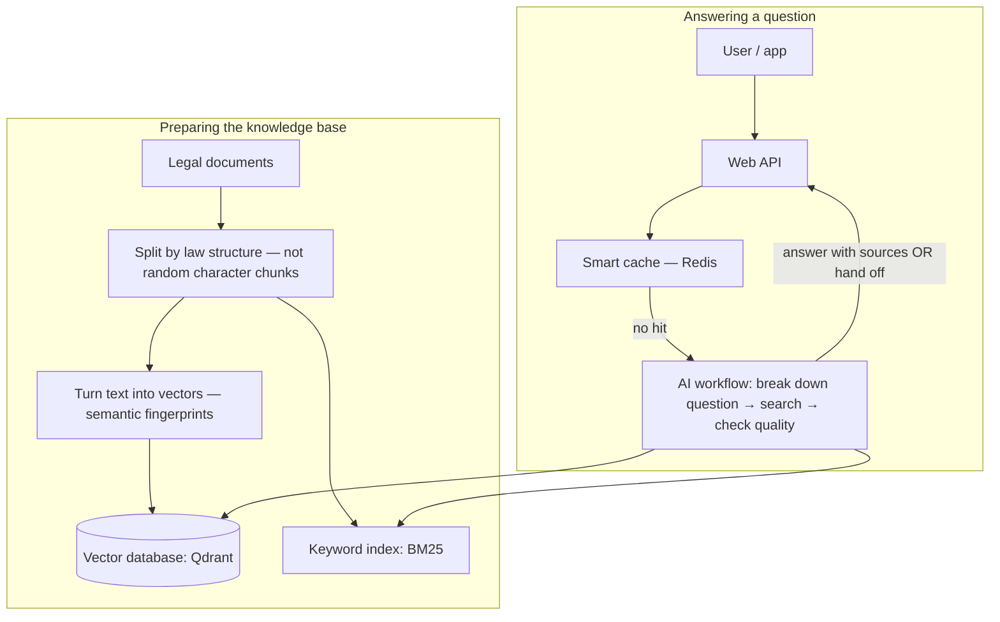

# Enterprise RAG — Dutch tax & law assistant

[](https://github.com/jimenez10frank/Enterprise-RAG-Architecture/actions/workflows/ci.yml)
[](https://www.python.org/downloads/)
[](https://github.com/astral-sh/ruff)
[](https://mypy-lang.org/)

> **Nederlands — in het kort:** Dit project bouwt een **uitlegbaar vraag-en-antwoordsysteem** voor Nederlandse **fiscale en juridische** teksten. Het systeem **zoekt eerst** in betrouwbare bronnen en geeft antwoord **met bronvermelding** (wet, artikel, lid), in plaats van alleen te “gokken”. Hieronder staat de uitleg verder in het **Engels** (handig voor internationale beoordelaars en tech-docs). Het diepere verhaal staat ook in [`docs/design/architecture.md`](docs/design/architecture.md) — daar staat nu **eerst** eenvoudige taal en **daarna** techniek.

## What is this project?

This is a **smart Q&A system** for **Dutch tax and legal texts**. It does _not_ guess from memory alone: it **looks up** relevant passages, then answers **with citations** (which law, which article, which paragraph).

**RAG** means _Retrieval-Augmented Generation_: first retrieve trustworthy text, then let the language model write an answer **based only on that text**.

The repo contains:

1. **Working code** you can run locally (small demo dataset).
2. A **design document** that explains how you would scale this for a real government setting (millions of text fragments, stricter security).

If you are new here: start with the [plain-language architecture overview](docs/design/architecture.md) — it explains the ideas before the jargon.

---

## What does the system do, in one picture?



**Highlights**

- **Permissions (RBAC):** who may see which documents is enforced **during search**, so secret fraud-investigation material never enters the pipeline for unauthorised roles.
- **Hybrid search:** keyword search (good for exact references) + semantic search (good for “what does this mean?”).
- **Safety loop (CRAG):** if the retrieved text is a poor match, the system **avoids guessing** and can **escalate** instead.

---

## Quick start (local demo)

You need **Python 3.11+**, **Docker**, and API keys from **OpenAI** and **Cohere** (for embeddings / LLM and reranking in this demo).

1. **Get the code and configure secrets**

   ```bash
   git clone https://github.com/jimenez10frank/Enterprise-RAG-Architecture.git
   cd Enterprise-RAG-Architecture
   cp .env.example .env
   ```

   Open `.env` and add at least `OPENAI_API_KEY` and `COHERE_API_KEY`. `LANGSMITH_API_KEY` is optional (tracing).

2. **Start databases**

   ```bash
   docker compose up -d
   ```

   - Qdrant (vectors): http://localhost:6333/dashboard
   - Redis tools: http://localhost:8001

3. **Install Python dependencies**
   - Recommended: [`uv sync`](https://github.com/astral-sh/uv)
   - Or: `pip install -e .` and install `pytest`, `ruff`, `mypy` if you want the same checks as CI.

4. **Load the demo documents into Qdrant**

   ```bash
   python scripts/ingest.py
   ```

5. **Start the API**

   ```bash
   uvicorn src.api.main:app --reload --host 0.0.0.0 --port 8000
   ```

   - Interactive API docs: http://localhost:8000/docs
   - Ask a question: `POST /query` with JSON like `{"question": "Your question here"}`
   - Send header `X-User-Role: helpdesk` (or another role) — permissions depend on it.
   - Health check: `GET /health`

---

## Where to read more

| Document | Who is it for? |
|----------|----------------|
| [Architecture (friendly + technical)](docs/design/architecture.md) | How and why the system is built |
| [Project handbook (requirements, traps, roadmap)](docs/project/README.md) | Assessment brief, stack, workflow, progress |
| [Concepts — short lessons](docs/concepts/CONCEPTS_INDEX.md) | Bite-sized explanations (embeddings, search, permissions, …) |
| [Decisions (ADRs)](docs/decisions/DECISIONS_INDEX.md) | Why we chose X over Y |
| [Things we refuse to get wrong](docs/project/TRAPS.md) | Non‑negotiable design rules |
| [Roadmap](docs/project/ROADMAP.md) and [progress log](docs/project/PROGRESS.md) | Phasing and what is done |

## Evaluation (quality checks)

We keep a small set of test questions with expected behaviours: [data/golden/golden_set.jsonl](data/golden/golden_set.jsonl).

Run: `python scripts/eval.py --help`
Automated eval on `main`: [.github/workflows/eval.yml](.github/workflows/eval.yml)

---

## Important note

This project was built for a **learning / assessment** context. The sample documents are **not** a full copy of official sources. If you ever use ideas from here for **real classified data**, read [docs/project/TRAPS.md](docs/project/TRAPS.md) first — especially permissions, caching rules, and where embeddings may legally be computed.
