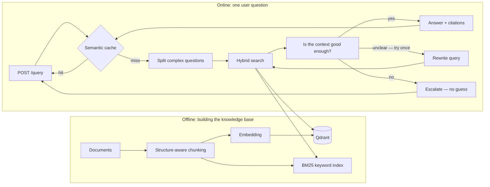
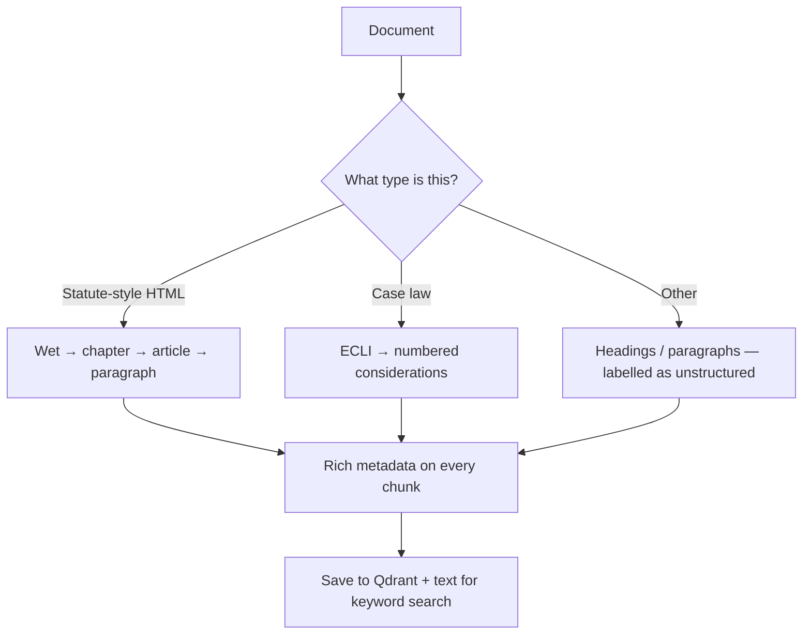
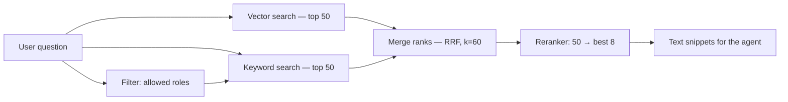
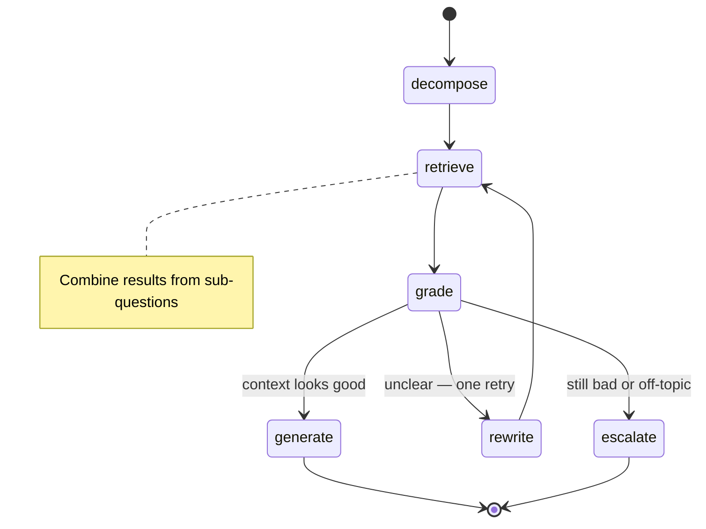

# Architecture — explained clearly

> **Nederlands:** Dit document legt uit **hoe het systeem in elkaar zit** — eerst in **begrijpelijke taal**, daarna met de technische details die een assessment of een DevOps-team verwacht. Engelse termen (RAG, RBAC, …) blijven waar ze in de code voorkomen; open het [begrippen-overzicht](../concepts/CONCEPTS_INDEX.md) als je een term wilt bijschaven.

This document answers the assessment question: _how would you design a secure, accurate AI assistant for tax and legal staff?_

**Two layers in one place**

- **What you can run today** — a small demo in this GitHub repository.
- **What you would run in production** — millions of text snippets, stricter rules for secret documents, and heavier infrastructure.

If a term is new to you, skim the [concept notes](../concepts/CONCEPTS_INDEX.md); they unpack ideas like _embeddings_, _HNSW_, and _RRF_ in plain language.

---

## 1. Big picture: the four building blocks

Think of the system as four cooperating parts:

| Block               | Plain English                                                                                               | Typical tech in this repo        |
| ------------------- | ----------------------------------------------------------------------------------------------------------- | -------------------------------- |
| **1. Ingestion**    | Read laws and memos, **cut them at meaningful boundaries** (article, paragraph), label them, store vectors. | Chunker, embeddings, Qdrant      |
| **2. Retrieval**    | Given a question, **find** the best matching passages — respecting **who is allowed to see what**.          | BM25 + vectors, fusion, reranker |
| **3. Agent (CRAG)** | **Check** whether the found text is good enough; if not, **do not bluff** — rewrite or escalate.            | LangGraph workflow               |
| **4. Ops**          | **Cache** frequent questions safely, expose an **API**, **measure** quality in CI.                          | Redis, FastAPI, Ragas            |

---

## 1.2 How a question travels through the system



---

## 2. Module 1 — Ingestion and knowledge structure

### 2.1 Why not “split every 500 characters”?

Laws are **hierarchical**. A user needs answers that cite **which statute, article, and paragraph**. If we chop text blindly, those boundaries disappear and citations become unreliable.

So we **chunk by structure** (e.g. wet → artikel → _lid_) where the document format allows it. Case law uses a different structure (e.g. ECLI and _rechtsoverwegingen_). Messy documents fall back to headings and paragraphs, still with honest metadata.



### 2.2 What metadata sits on every chunk?

Each chunk carries fields you see in `src/ingestion/schema.py`, including:

- Legal **position** in the hierarchy (wet, artikel, _lid_, etc.).
- **Sensitivity**: public / internal / FIOD-style, plus **`allowed_roles`** — who may retrieve this chunk at all.

Design rule (**TRAP 1** in [`TRAPS.md`](../project/TRAPS.md)): no “dumb” character-only splitter for statute text; structure first.

### 2.3 Vector database and “what knobs do we turn?”

**Choice:** **Qdrant** for large-scale production (tens of millions of vectors, strong filtered search). For a classroom-scale Postgres + pgvector setup, see the trade-offs in `docs/project/TRAPS.md` — we still document Qdrant as the primary production target.

**Numbers used in this repository** (`src/ingestion/qdrant_setup.py`):

| Setting                 | Value (demo)                      | Intuition                                                                                            |
| ----------------------- | --------------------------------- | ---------------------------------------------------------------------------------------------------- |
| **Distance**            | Cosine                            | Standard for normalised embedding vectors.                                                           |
| **HNSW `m`**            | 32                                | Graph “fan-out”; higher tends to help **recall** (fewer missed matches) at some memory cost.         |
| **HNSW `ef_construct`** | 256                               | Quality of the index **while building**; higher = slower build, often better search quality.         |
| **Quantisation**        | Scalar INT8 (quantile 0.99)       | Stores vectors more compactly to save RAM; we **rescore** good candidates with full precision again. |
| **`always_ram`**        | True                              | Keep active vectors in memory for responsive search.                                                 |
| **Payload indexes**     | classification, roles, wet, dates | Speeds up **permission** and metadata filters.                                                       |

At truly huge scale you would also tune **search-time `ef`**, consider **sharding** (e.g. by law or document type), and maybe binary quantisation for frozen archives — all noted here so DevOps knows what to benchmark next.

### 2.4 Embeddings and confidential data

**Demo:** OpenAI `text-embedding-3-large` — great quality, easy to try.

**Production with secrets:** embeddings for classified text should be computed **inside your trust zone** (e.g. self-hosted multilingual model). **Never mix** vectors from two different embedding models in the **same** collection — their geometry is not compatible.

---

## 3. Module 2 — Retrieval (finding the right passages)

### 3.1 Two search styles, then merge

- **Keyword search (BM25)** shines when someone types an **exact reference** (numbers, ECLI-style ids).
- **Semantic / vector search** shines when someone **paraphrases** a concept.

We run **both** (with permission filters), then **merge** the ranked lists.



### 3.2 How we merge rankings (without cheating)

Raw BM25 scores and raw cosine scores **live on different scales**. **Averaging them with a fixed weight** (alpha blending) is fragile.

We use **Reciprocal Rank Fusion (RRF)** with **k = 60**: it only cares about **rank position**, not raw score numbers. Code: `src/retrieval/fusion.py`.

### 3.3 Permissions during search (RBAC)

**Critical security idea:** we **do not** “search everything, then throw away forbidden rows.” That can **leak information** through subtle ranking effects.

Instead, the dense search sends **role constraints into Qdrant** so disallowed vectors are **never part of the candidate set** (`src/retrieval/dense.py`). BM25 applies the same idea **before** scoring (`src/retrieval/bm25.py`).

### 3.4 Reranking — cast a wide net, then sharpen

We deliberately retrieve **top 50** from each path, fuse to **50**, then let a **cross-encoder-style reranker** (here: Cohere `rerank-multilingual-v3.0`) reduce to **top 8** for the generator.

**Why?** A reranker can only reorder what retrieval already surfaced. If the right paragraph was never in the top 50, reranking cannot rescue it.

---

## 4. Module 3 — Agent: check before you answer

### 4.1 Correction loop (CRAG) in simple terms

**CRAG** adds a **quality check** between “we found some text” and “the model talks to the user.” If the context is wrong or too thin, we **stop** instead of inventing.

The workflow is implemented in `src/agent/graph.py`:



### 4.2 Multi-part questions

**Implemented:** **Query decomposition** — the model may split one long user question into several shorter searches, then merge unique passages (`src/agent/nodes/decompose.py`).

**Not implemented (but noted for production):** **HyDE** — invent a short “ideal statutory paragraph”, embed it, search with that. Useful when user language differs a lot from legal Dutch; needs careful governance.

### 4.3 Grader: three outcomes, not just “OK / bad”

| Label          | What it means                               | What we do                                                                        |
| -------------- | ------------------------------------------- | --------------------------------------------------------------------------------- |
| **Relevant**   | Retrieved text can support a careful answer | Generate with **mandatory citations**.                                            |
| **Ambiguous**  | Text might be relevant but unclear          | **Rewrite** the query and search **once more**; if still ambiguous, **escalate**. |
| **Irrelevant** | Wrong topic or empty permission scope       | **Escalate** — do **not** force an answer from bad context.                       |

Code: `src/agent/nodes/grade.py`.

### 4.4 Citations — structure, not just “please cite”

We use **typed model outputs** (Pydantic / structured LLM responses) and **post-checks**: every citation must point to a **real retrieved chunk**, and quoted text must **match** the source closely enough. One automatic retry, then escalate.

---

## 5. Module 4 — Running it safely in production

### 5.1 Semantic cache (speed without silly mistakes)

Similar questions can reuse a past answer — **but** fiscal law changes by year, and permissions differ by role.

| Rule                     | Value                                        | Why                                                                                    |
| ------------------------ | -------------------------------------------- | -------------------------------------------------------------------------------------- |
| **Similarity threshold** | ≥ **0.97** (cosine)                          | Stops “2024 vs 2025” style questions from wrongly sharing an answer.                   |
| **Cache key**            | Role + corpus version + question fingerprint | Stops **permission leaks** via cache and invalidates answers when data is re-ingested. |
| **TTL**                  | 24 hours                                     | Keeps answers reasonably fresh.                                                        |

Implementation: `src/ops/cache.py`. At scale you might move to a vector index inside Redis (**RediSearch**) instead of scanning small buckets.

### 5.2 RBAC recap (one paragraph you can quote in an interview)

**Filtering only after search returns results is unsafe** — excluded documents can still distort _which_ allowed documents appear near the top. **Putting secrets in the prompt and begging the model to ignore them is unsafe** — the context already leaked.

**Correct pattern:** enforce **allowed_roles** (and similar flags) **inside the vector query** so forbidden chunks never participate in nearest-neighbour ranking. Mirror that discipline in the **cache key**.

### 5.3 HTTP API

`src/api/main.py` exposes `POST /query` (question + role header) and `GET /health`. Response headers report timing and cache **hit** vs **miss**.

### 5.4 Quality metrics and CI

We track **Ragas**-style metrics on a golden file (`data/golden/golden_set.jsonl`).

| Metric                         | Plain English                                    | How strict?                                                                                                  |
| ------------------------------ | ------------------------------------------------ | ------------------------------------------------------------------------------------------------------------ |
| **Faithfulness**               | Does every claim trace back to retrieved text?   | **Gate:** mean on _answered_ items should stay ≥ **0.95** in our automation (`scripts/eval.py`, `eval.yml`). |
| **Context precision / recall** | Was retrieval focused? Did we miss key passages? | Trends and warnings — human review.                                                                          |
| **Answer relevancy**           | Did we actually answer the question?             | Same — diagnostic.                                                                                           |

Optional **LangSmith** traces help debug individual runs when keys are present.

---

## 6. Where each design “trap” is covered

[`TRAPS.md`](../project/TRAPS.md) lists mistakes we deliberately avoid. This document maps them by section: chunking (§2), RBAC (§3.3, §5.2), Qdrant vs pgvector (§2.3), RRF (§3.2), cache (§5.1), citations (§4.4), grader (§4.3), rerank sizes (§3.4), HyDE vs decomposition (§4.2), embeddings residency (§2.4), metrics (§5.4).

---

## 7. Demo vs production (honest comparison)

| Topic       | This repository                  | Full production                                                  |
| ----------- | -------------------------------- | ---------------------------------------------------------------- |
| Data volume | Small curated / synthetic sample | Hundreds of thousands of documents, → tens of millions of chunks |
| Embeddings  | OpenAI API (demo convenience)    | Self-hosted for classified material                              |
| Cache       | Simple Redis structure           | Likely indexed vector cache at scale                             |
| Reranker    | Cohere API                       | Often self-hosted GPU service at high traffic                    |

---

## 8. Future work

- Harvest and normalise a **large set of official sources** (beyond the demo corpus).
- **HyDE** with explicit triggers and audit logging.
- Stronger **cache indexing** (e.g. RediSearch KNN).
- Larger **golden sets** and regression suites per embedding / LLM upgrade.

---

## 9. Related documents

- Assignment: [`ASSESSMENT.md`](../project/ASSESSMENT.md)
- Non-negotiable rules: [`TRAPS.md`](../project/TRAPS.md)
- Stack choices: [`STACK.md`](../project/STACK.md)
- Decision log: [`docs/decisions/DECISIONS_INDEX.md`](../decisions/DECISIONS_INDEX.md)
- Learning notes: [`docs/concepts/CONCEPTS_INDEX.md`](../concepts/CONCEPTS_INDEX.md)

---

## Appendix — pseudo-code for engineers

These sketches mirror the real modules; they are here so a dev team can compare **intent** to **`src/`**.

**A. Idempotent Qdrant collection (compare with `src/ingestion/qdrant_setup.py`)**

```python
def ensure_collection(client, name: str) -> None:
    if client.collection_exists(name):
        return
    client.create_collection(
        collection_name=name,
        vectors_config=VectorParams(
            size=3072,
            distance=Distance.COSINE,
            quantization_config=ScalarQuantization(
                type=ScalarType.INT8,
                quantile=0.99,
                always_ram=True,
            ),
            hnsw_config=HnswConfigDiff(m=32, ef_construct=256),
        ),
    )
    for field, schema_type in payload_indexes:
        client.create_payload_index(
            collection_name=name, field_name=field, field_schema=schema_type
        )
```

**B. Reciprocal Rank Fusion, k=60 (`src/retrieval/fusion.py`)**

```python
def rrf(rankings: list[list[str]], k: int = 60) -> list[tuple[str, float]]:
    scores: dict[str, float] = {}
    for ranking in rankings:
        for rank, chunk_id in enumerate(ranking, start=1):
            scores[chunk_id] = scores.get(chunk_id, 0.0) + 1.0 / (k + rank)
    return sorted(scores.items(), key=lambda x: x[1], reverse=True)
```
